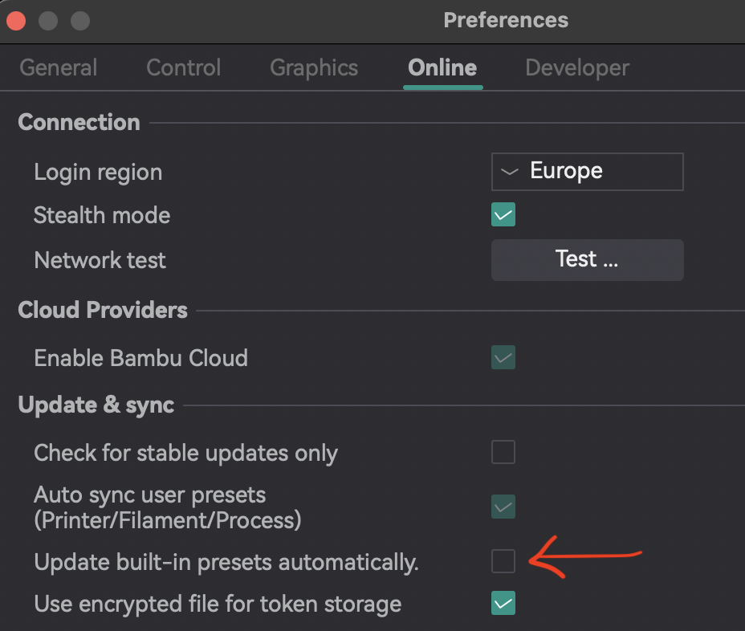
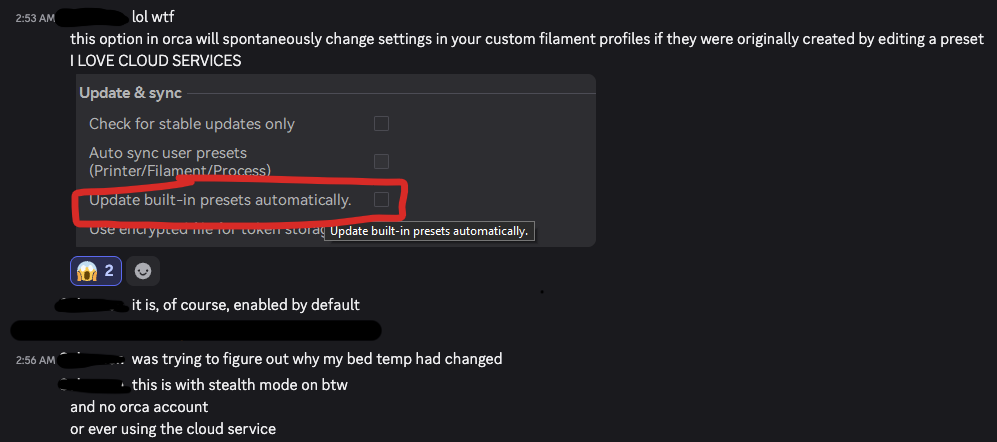

# OrcaSlicer-json-inherit-concat

Script to concatenate JSON configs based on inherited settings.

## Overview

OrcaSlicer et al, Bambu Studion, Qidi Studio, use JSON files to store profiles. Be it printers, processes or filaments. To keep changes and file sizes to a minimum (I think) they use an dependency/inheritance system on generic profiles, to only adjust the differences we want.

Since recent versions, there is a setting which can dynamically update those generic profiles that your custom profiles depend on...



As a result, this can mean that your print now comes out differently, or even fails because underlying settings have been altered without you knowing. It also makes it very hard to exchange profiles with each other, because one having the setting enabled, and the other not, would mean that the "same" profile has different results on the same printer model... 

We're not in an inherent "Cloud is bad" situation, most folks probably won't notice, but the high-end spectrum of users definitely will, and already have:



My script `orca-json-concat.sh` resolves and flattens the **inheritance chain** of OrcaSlicer JSON profile files. OrcaSlicer profiles can reference a parent profile via the `"inherits"` key. This script walks that chain from child to root, then merges every file in order (root → child) so that child values override parent values. The result is a single, self-contained JSON file with no remaining `"inherits"` reference, and will therefore not change if someone decides to alter the "Generic PETG" or "Sunlu ABS" profile for instance.

## Prerequisites

| Requirement | Details |
|---|---|
| **Bash** | A Bash-compatible shell (tested with `#!/usr/bin/env bash`) |
| **jq** | [jq](https://stedolan.github.io/jq/) must be installed and available on your `$PATH` |

## Usage

```bash
./orca-json-concat.sh -f <fileToCheck> -c <componentName> [-l <orcaProfilesLocation>] [-t <targetLocation>] [-d true]
```

### Parameters

| Flag | Name | Required | Description |
|---|---|---|---|
| `-f` | `fileToCheck` | **Yes** | Path to the starting JSON profile file whose inheritance chain you want to flatten. |
| `-c` | `componentName` | **Yes** | The OrcaSlicer component type (e.g. `process`, `filament`, `machine`). Used to locate default profiles and to name the output file. |
| `-l` | `orcaProfilesLocation` | No | Directory where OrcaSlicer's built-in system profiles live. **Default (macOS):** `~/Library/Application Support/OrcaSlicer/system/BBL/<componentName>` (the `~` is resolved to the current user's home directory automatically). On Linux you must supply the correct path manually. |
| `-t` | `targetLocation` | No | Directory where the merged output file will be written. **Default:** `/tmp`. |
| `-d` | Debug mode | No | Enables verbose debug logging. The flag accepts an argument (e.g. `-d true`) but the value itself is ignored — any value activates debug mode. To disable debug output, omit `-d` entirely; passing `-d false` will **still enable** debug mode. |

### Example

```bash
./orca-json-concat.sh \
  -f "Sunlu Pla +.json" \
  -c process \
  -l "/home/jaykay/.config/orca" \
  -t "/opt/hereIsWhereIwantIt" \
  -d true
```

> **Tip:** Always quote file paths and names, especially when they contain spaces or special characters.

## How It Works

1. **Read the starting file** – The script reads the JSON file supplied with `-f` and extracts its `"inherits"` value using `jq`.
2. **Walk the inheritance chain** – For each inherited profile name found, the script looks for a matching `.json` file in the following order:
   - The **current working directory** (`./<inherited_name>.json`).
   - The **OrcaSlicer system profiles directory** (`<orcaProfilesLocation>/<inherited_name>.json`).
   
   The process repeats until a file without an `"inherits"` key (the root ancestor) is reached.
3. **Reverse the dependency order** – The collected chain (child → root) is reversed to root → child so that child settings correctly override parent settings during the merge.
4. **Merge with jq** – All files are merged using `jq -s 'add'`. The resulting JSON:
   - Has the `"inherits"` key **removed** (it is no longer needed).
   - Has all keys **lowercased** and **sorted alphabetically**.
5. **Write the output** – The merged profile is written to:
   ```
   <targetLocation>/orcaslicer_<componentName>_<sanitisedFileName>_inherit_concat-<YYYYmmdd-HHMMSS>.json
   ```

## Exit Codes

| Code | Meaning |
|---|---|
| `0` | Success – the merged file was created and variables were cleaned up. |
| `10` | No file was specified (`-f` is missing). |
| `11` | No component name was specified (`-c` is missing). |
| `12` | The starting file does not contain an `"inherits"` key; there is nothing to merge. |
| `20` | An inherited file could not be found in either the current directory or the OrcaSlicer profiles directory. |
| Non-zero | `jq` or cleanup failed; the exit code from the failing command is forwarded. |

## Output

On success the script prints the path to the generated file:

```
YYYYmmdd-HHMMSS Done! Cleaning up after myself!
YYYYmmdd-HHMMSS Cleanup successful!
YYYYmmdd-HHMMSS Please check your result in file /tmp/orcaslicer_process_SunluPla_inherit_concat-20260703-145500.json
```

## License

See [LICENSE](LICENSE) for details.
